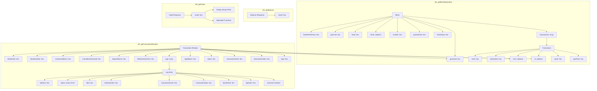

```mermaid
graph TD
    subgraph eth_getBlockByNumber
        Block[Block] --> BaseFee[baseFeePerGas: hex]
        Block --> GasLimit[gasLimit: hex]
        Block --> GasUsed[gasUsed: hex]
        Block --> Hash[hash: hex]
        Block --> Miner[miner: address]
        Block --> Number[number: hex]
        Block --> ParentHash[parentHash: hex]
        Block --> Timestamp[timestamp: hex]
        Block --> Txs[transactions: array]

        Txs --> Tx[Transaction]
        Tx --> TxHash[hash: hex]
        Tx --> TxBlock[blockHash: hex]
        Tx --> From[from: address]
        Tx --> To[to: address]
        Tx --> Value[value: hex]
        Tx --> GasPrice[gasPrice: hex]
    end

    subgraph eth_getBalance
        Balance[Balance Response] --> BalanceVal[result: hex]
    end

    subgraph eth_getCode
        Code[Code Response] --> CodeVal[result: hex]
        CodeVal --> Empty[Empty string if EOA]
        CodeVal --> Bytes[Bytecode if contract]
    end

    subgraph eth_getTransactionReceipt
        Receipt[Transaction Receipt] --> BlockHash[blockHash: hex]
        Receipt --> BlockNumber[blockNumber: hex]
        Receipt --> ContractAddress[contractAddress: hex]
        Receipt --> CumulativeGasUsed[cumulativeGasUsed: hex]
        Receipt --> DepositNonce[depositNonce: hex]
        Receipt --> EffectiveGasPrice[effectiveGasPrice: hex]
        Receipt --> From[from: address]
        Receipt --> GasUsed[gasUsed: hex]
        Receipt --> Logs[logs: array]
        Receipt --> LogsBloom[logsBloom: hex]
        Receipt --> Status[status: hex]
        Receipt --> To[to: address]
        Receipt --> TransactionHash[transactionHash: hex]
        Receipt --> TransactionIndex[transactionIndex: hex]
        Receipt --> Type[type: hex]

        Logs --> Log[Log Entry]
        Log --> LogAddress[address: hex]
        Log --> LogTopics[topics: array of hex]
        Log --> LogData[data: hex]
        Log --> LogBlockNumber[blockNumber: hex]
        Log --> LogTransactionHash[transactionHash: hex]
        Log --> LogTransactionIndex[transactionIndex: hex]
        Log --> LogBlockHash[blockHash: hex]
        Log --> LogIndex[logIndex: hex]
        Log --> LogRemoved[removed: boolean]
    end
```
