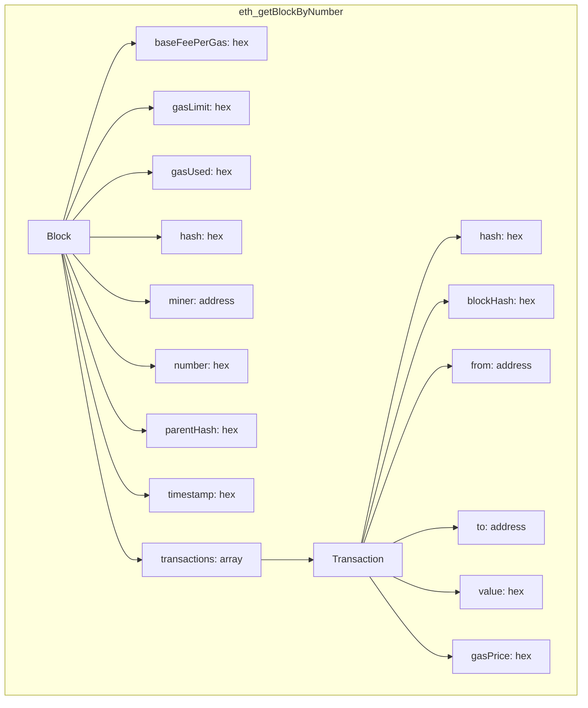

```mermaid
graph TD
    subgraph eth_getBlockByNumber
        Block[Block] --> BaseFee[baseFeePerGas: hex]
        Block --> GasLimit[gasLimit: hex]
        Block --> GasUsed[gasUsed: hex]
        Block --> Hash[hash: hex]
        Block --> Miner[miner: address]
        Block --> Number[number: hex]
        Block --> ParentHash[parentHash: hex]
        Block --> Timestamp[timestamp: hex]
        Block --> Txs[transactions: array]

        Txs --> Tx[Transaction]
        Tx --> TxHash[hash: hex]
        Tx --> TxBlock[blockHash: hex]
        Tx --> From[from: address]
        Tx --> To[to: address]
        Tx --> Value[value: hex]
        Tx --> GasPrice[gasPrice: hex]
    end
```
