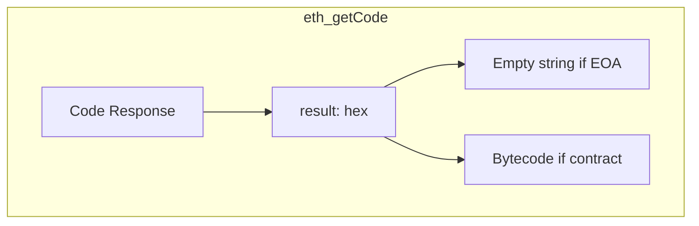

```mermaid
graph TD
    subgraph eth_getCode
        Code[Code Response] --> CodeVal[result: hex]
        CodeVal --> Empty[Empty string if EOA]
        CodeVal --> Bytes[Bytecode if contract]
    end
```
