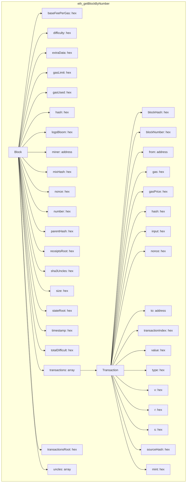

```mermaid
graph TD
    subgraph eth_getBlockByNumber
        Block[Block] --> BaseFee[baseFeePerGas: hex]
        Block --> Difficulty[difficulty: hex]
        Block --> ExtraData[extraData: hex]
        Block --> GasLimit[gasLimit: hex]
        Block --> GasUsed[gasUsed: hex]
        Block --> Hash[hash: hex]
        Block --> LogsBloom[logsBloom: hex]
        Block --> Miner[miner: address]
        Block --> MixHash[mixHash: hex]
        Block --> Nonce[nonce: hex]
        Block --> Number[number: hex]
        Block --> ParentHash[parentHash: hex]
        Block --> ReceiptsRoot[receiptsRoot: hex]
        Block --> Sha3Uncles[sha3Uncles: hex]
        Block --> Size[size: hex]
        Block --> StateRoot[stateRoot: hex]
        Block --> Timestamp[timestamp: hex]
        Block --> TotalDifficulty[totalDifficult: hex]
        Block --> Txs[transactions: array]
        Block --> TxsRoot[transactionsRoot: hex]
        Block --> Uncles[uncles: array]

        Txs --> Tx[Transaction]
        Tx --> BlockHash[blockHash: hex]
        Tx --> BlockNumber[blockNumber: hex]
        Tx --> From[from: address]
        Tx --> Gas[gas: hex]
        Tx --> GasPrice[gasPrice: hex]
        Tx --> TxHash[hash: hex]
        Tx --> Input[input: hex]
        Tx --> TxNonce[nonce: hex]
        Tx --> To[to: address]
        Tx --> TxIndex[transactionIndex: hex]
        Tx --> Value[value: hex]
        Tx --> Type[type: hex]
        Tx --> V[v: hex]
        Tx --> R[r: hex]
        Tx --> S[s: hex]
        Tx --> SourceHash[sourceHash: hex]
        Tx --> Mint[mint: hex]
    end
```
