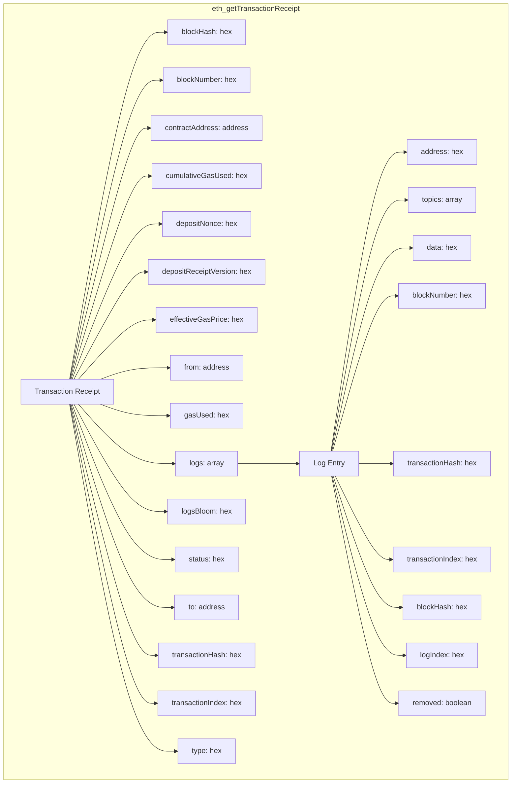

```mermaid
graph TD
    subgraph eth_getTransactionReceipt
        Receipt[Transaction Receipt] --> BlockHash[blockHash: hex]
        Receipt --> BlockNumber[blockNumber: hex]
        Receipt --> ContractAddress[contractAddress: address]
        Receipt --> CumulativeGasUsed[cumulativeGasUsed: hex]
        Receipt --> DepositNonce[depositNonce: hex]
        Receipt --> DepositReceiptNonce[depositReceiptVersion: hex]
        Receipt --> EffectiveGasPrice[effectiveGasPrice: hex]
        Receipt --> From[from: address]
        Receipt --> GasUsed[gasUsed: hex]
        Receipt --> Logs[logs: array]
        Receipt --> LogsBloom[logsBloom: hex]
        Receipt --> Status[status: hex]
        Receipt --> To[to: address]
        Receipt --> TransactionHash[transactionHash: hex]
        Receipt --> TransactionIndex[transactionIndex: hex]
        Receipt --> Type[type: hex]

        Logs --> Log[Log Entry]
        Log --> LogAddress[address: hex]
        Log --> LogTopics[topics: array]
        Log --> LogData[data: hex]
        Log --> LogBlockNumber[blockNumber: hex]
        Log --> LogTransactionHash[transactionHash: hex]
        Log --> LogTransactionIndex[transactionIndex: hex]
        Log --> LogBlockHash[blockHash: hex]
        Log --> LogIndex[logIndex: hex]
        Log --> LogRemoved[removed: boolean]
    end
```
