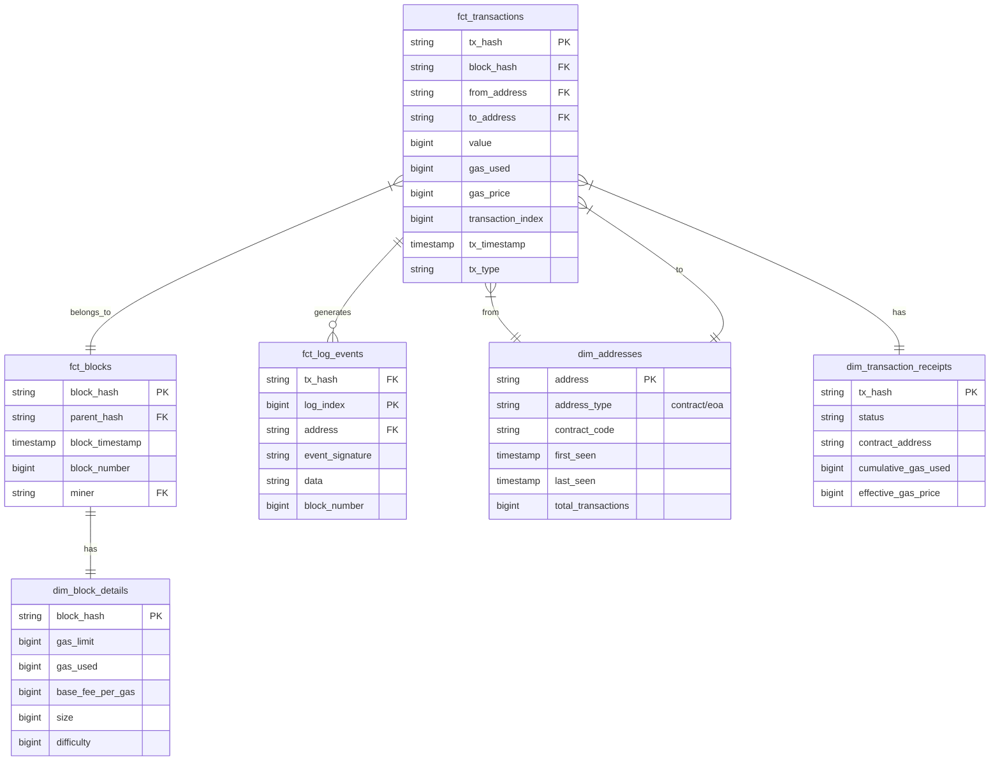

```mermaid
erDiagram
    %% Core Fact Tables
    fct_transactions {
        string tx_hash PK
        string block_hash FK
        string from_address FK
        string to_address FK
        bigint value
        bigint gas_used
        bigint gas_price
        bigint transaction_index
        timestamp tx_timestamp
        string tx_type
    }

    fct_blocks {
        string block_hash PK
        string parent_hash FK
        timestamp block_timestamp
        bigint block_number
        string miner FK
    }

    fct_log_events {
        string tx_hash FK
        bigint log_index PK
        string address FK
        string event_signature
        string data
        bigint block_number
    }

    %% Dimension Tables
    dim_addresses {
        string address PK
        string address_type "contract/eoa"
        string contract_code
        timestamp first_seen
        timestamp last_seen
        bigint total_transactions
    }

    dim_block_details {
        string block_hash PK
        bigint gas_limit
        bigint gas_used
        bigint base_fee_per_gas
        bigint size
        bigint difficulty
    }

    dim_transaction_receipts {
        string tx_hash PK
        string status
        string contract_address
        bigint cumulative_gas_used
        bigint effective_gas_price
    }

    %% Relationships
    fct_transactions ||--o{ fct_log_events : "generates"
    fct_transactions }|--|| dim_transaction_receipts : "has"
    fct_transactions }|--|| fct_blocks : "belongs_to"
    fct_transactions }|--|| dim_addresses : "from"
    fct_transactions }|--|| dim_addresses : "to"
    fct_blocks ||--|| dim_block_details : "has"
``` 