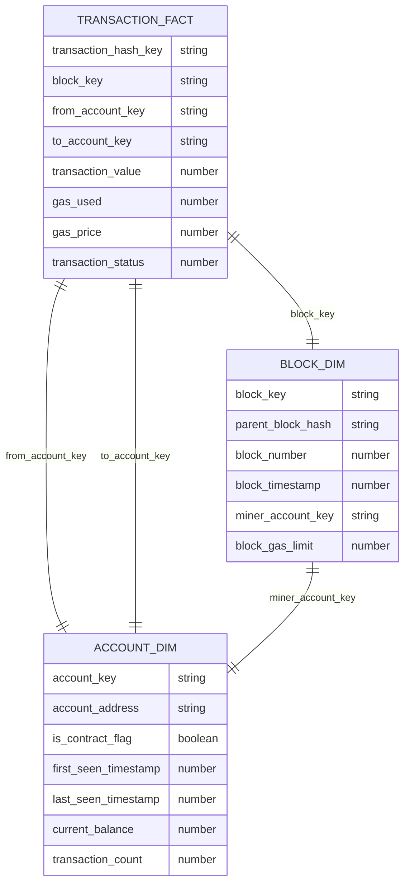

```mermaid
erDiagram
    TRANSACTION_FACT {
        transaction_hash_key string
        block_key string
        from_account_key string
        to_account_key string
        transaction_value number
        gas_used number
        gas_price number
        transaction_status number
    }

    BLOCK_DIM {
        block_key string
        parent_block_hash string
        block_number number
        block_timestamp number
        miner_account_key string
        block_gas_limit number
    }

    ACCOUNT_DIM {
        account_key string
        account_address string
        is_contract_flag boolean
        first_seen_timestamp number
        last_seen_timestamp number
        current_balance number
        transaction_count number
    }


    TRANSACTION_FACT ||--|| BLOCK_DIM : "block_key"
    TRANSACTION_FACT ||--|| ACCOUNT_DIM : "from_account_key"
    TRANSACTION_FACT ||--|| ACCOUNT_DIM : "to_account_key"
    BLOCK_DIM ||--|| ACCOUNT_DIM : "miner_account_key"
```
