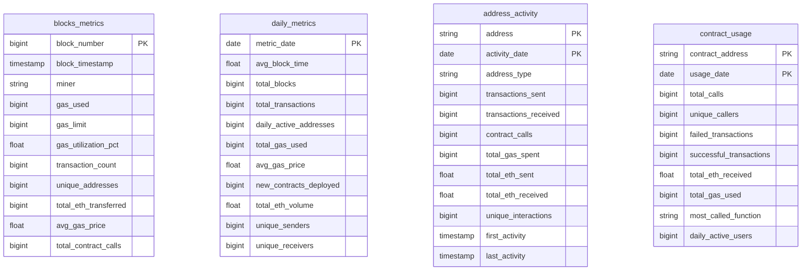

```mermaid
erDiagram
    %% Gold Layer Tables
    blocks_metrics {
        bigint block_number PK
        timestamp block_timestamp
        string miner
        bigint gas_used
        bigint gas_limit
        float gas_utilization_pct
        bigint transaction_count
        bigint unique_addresses
        bigint total_eth_transferred
        float avg_gas_price
        bigint total_contract_calls
    }

    daily_metrics {
        date metric_date PK
        float avg_block_time
        bigint total_blocks
        bigint total_transactions
        bigint daily_active_addresses
        bigint total_gas_used
        float avg_gas_price
        bigint new_contracts_deployed
        float total_eth_volume
        bigint unique_senders
        bigint unique_receivers
    }

    address_activity {
        string address PK
        date activity_date PK
        string address_type
        bigint transactions_sent
        bigint transactions_received
        bigint contract_calls
        bigint total_gas_spent
        float total_eth_sent
        float total_eth_received
        bigint unique_interactions
        timestamp first_activity
        timestamp last_activity
    }

    contract_usage {
        string contract_address PK
        date usage_date PK
        bigint total_calls
        bigint unique_callers
        bigint failed_transactions
        bigint successful_transactions
        float total_eth_received
        bigint total_gas_used
        string most_called_function
        bigint daily_active_users
    }
``` 